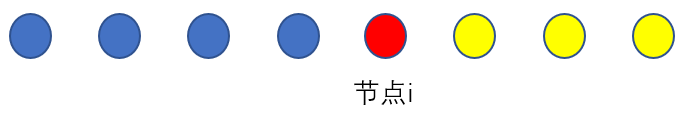
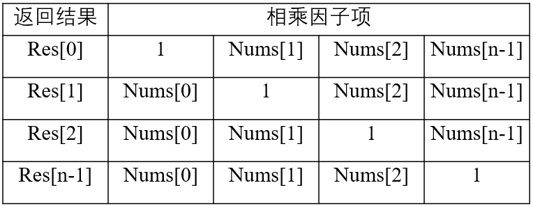

# Leetcode 100Top-like

## LRU缓存

### 使用哈希表和双向链表实现 利用哈希表查找复杂度和链表的添加删除复杂度

```c++
class LRUCache {
private:
    int capacity;
    list<pair<int,int>> cache;
     unordered_map<int, list<pair<int, int>>::iterator> map;    
public:
    LRUCache(int capacity) {
        this->capacity=capacity;
    }
    
    int get(int key) {
        auto it=map.find(key);
        if(it == map.end()) return -1;
        pair<int,int> ans= *map[key];
        cache.erase(map[key]);
        cache.push_front(ans);
        map[key]= cache.begin();
        return ans.second;
    }
    
    void put(int key, int value) {
        auto it=map.find(key);
        if(it == map.end()){
            if(map.size()==capacity){
                auto temp=cache.back();
                map.erase(temp.first);
                cache.pop_back();
            }
            cache.push_front(make_pair(key,value));
            map[key]=cache.begin();
            return;
        }
        cache.erase(map[key]);
        cache.push_front(make_pair(key,value));
        map[key]= cache.begin();
    }
};
```

## 三数相加为0

```c++
class Solution {
public:
    vector<vector<int>> threeSum(vector<int>& nums) {
        sort(nums.begin(), nums.end());
        int N = nums.size();
        vector<vector<int> > res;
        for (int i = 0; i < N - 2; ++i) {
            if (nums[i] > 0) break;
            if (i > 0 && nums[i] == nums[i - 1]) continue;
            int l = i + 1;
            int r = N - 1;
            while (l < r) {
                int s = nums[i] + nums[l] + nums[r];
                if (s > 0) {
                    --r;
                } else if (s < 0) {
                    ++l;
                } else {
                    res.push_back({nums[i], nums[l], nums[r]});
                    while (l < r && nums[l] == nums[++l]);
                    while (l < r && nums[r] == nums[--r]);
                }
            }
        }
        return res;
    }
};
```


## String的乘法

### 基于竖乘原则来进行编程 降低复杂度

```c++
class Solution {
public:
    string multiply(string num1, string num2) {
        int length1=num1.size(),length2=num2.size();
        string res(length1+length2,'0');

        for(int i=length1-1; i>=0; --i){
            for (int j=length2-1; j>=0; --j){
                int temp=res[i+j+1]-'0'+(num1[i]-'0')*(num2[j]-'0');
                res[i+j+1]='0'+temp%10;
                res[i+j]+=temp/10;
            }
        }

        for(int i=0; i<res.size();++i){
            if (res[i]-'0') return res.substr(i);
        }

        return "0";
    }
};
```


## 缺失的第一个正数

### 通过记录1~size内最小未出现的正整数实现

#### 原版本

```C++
class Solution {
public:
    int firstMissingPositive(vector<int>& nums) {
        vector<int> vec(nums.size()+2);
        for(int i=0; i<nums.size() ;++i){
            if(nums[i]>=0 && nums[i]<= nums.size()) vec[nums[i]]=1;
        }
        for(int i=1; i<vec.size(); ++i){
            if(vec[i]==0) return i;
        }
        return 0;
    }
};
```

#### 新版本

```c++
class Solution {
public:
    int firstMissingPositive(vector<int>& nums) {
        int length=nums.size();
        for(int index=0; index <length ; ++index){
            while(nums[index]>0 && nums[index]<=nums.size() && nums[index]!=index+1 && nums[nums[index]-1]!=nums[index]){
                swap(nums[index],nums[nums[index]-1]);
            }
        }
        for(int index=0; index< nums.size();++index){
            if(index+1!=nums[index]) return index+1;
        }
        return length+1;
    }
};
```

##### 

## 跳跃游戏

#### 原版本

```c++
class Solution {
public:
    bool canJump(vector<int>& nums) {
        int length=nums.size();
        vector<int> flag(length);
        for(int i=0; i<length; ++i){
            if(flag[i] || i==0 ) {for(int j=0; j<=nums[i] && j+i<length; ++j) flag[j+i]=1;continue;}
            break;
        }
        for(int i=1; i<length; ++i){
            if(flag[i]==0) return false;
        }
        return true;
    }
};
```

#### 新版本

##### 最远可到达的点进行比较

```c++
class Solution {
public:
    bool canJump(vector<int>& nums) {
    int loc= 0;
	for (int temp = 0; temp < nums.size(); ++temp)
	{
		if (temp > loc) return false;
		loc = max(loc, temp + nums[temp]);
        if (loc >=nums.size()) return true;
	}
	return true;
    }
};
```


## 删除倒数第N个节点

```c++
class Solution {
public:
    ListNode* removeNthFromEnd(ListNode* head, int n) {
        ListNode *last_node=head;
        ListNode *temp_node=head;
        ListNode *prev_node=nullptr;
        while(n-1){
            --n;
            last_node=last_node->next;
        }
        while(last_node->next){
            prev_node=temp_node;
            last_node=last_node->next;
            temp_node=temp_node->next;
        }
        if(head==temp_node) return head->next;
        prev_node->next=temp_node->next;
        return head;
    }
};
```


## 盛水最多容器

```c++
class Solution {
public:
    int maxArea(vector<int>& height) {
        int i=0,j=height.size()-1;
        int max_area=(j-i)*min(height[i],height[j]);
        int flag=0;
        for(;i<j;){
            max_area=max(max_area,min(height[i],height[j])*(j-i));
            if(height[j]>height[i]) ++i;
            else --j;
        }
    return max_area;
    }
};
```


## 字符串中的查找与替换

```c++
class Solution {
public:
    string findReplaceString(string S, vector<int>& indexes, vector<string>& sources, vector<string>& targets) {
        int length=S.size();
        string res="";
        vector<int> flag(length,-1);
        int com_len=indexes.size();
        for(int i=0; i<com_len; ++i){
            int size=sources[i].size();
            string sub=S.substr(indexes[i],size);
            if(sources[i].compare(sub)==0) {
                flag[indexes[i]]=i;
                while(size!=1){
                    flag[indexes[i]+(--size)]=-2;
                }
            }
        }
        for(int index=0; index<length; ++index){
            if(flag[index]==-1){res+=S[index];}
            if(flag[index]>=0){res+=targets[flag[index]];}
        }
        return res;
    }
};
```


## 常数时间插入、删除和获取随机元素

hashmap用来 key->index(vector的索引位置),vector用来存储key值。插入比较简单，使用hashmap是映射索引便于在O(1)时间可以删除vector所对应的元素。

```c++
class RandomizedSet {
private:
    unordered_map<int,int> mymap;
    vector<int> key_index;
public:
    /** Initialize your data structure here. */
    RandomizedSet() {
        
    }
    
    /** Inserts a value to the set. Returns true if the set did not already contain the specified element. */
    bool insert(int val) {
        auto it=mymap.find(val);
        if(it != mymap.end()) return false;
        mymap[val]=key_index.size();
        key_index.push_back(val);
        return true;
    }
    
    /** Removes a value from the set. Returns true if the set contained the specified element. */
    bool remove(int val) {
        auto it=mymap.find(val);
        if(it == mymap.end()) return false;
        int size=key_index.size();
        int loc=mymap[val];

        mymap[key_index[size-1]]=loc;
        key_index[loc]=key_index[size-1];
        key_index.pop_back();
        mymap.erase(val);
        return true;
    }
    
    /** Get a random element from the set. */
    int getRandom() {
        int size=key_index.size();
        if(size == 0) return 0;
        int index=rand()%size;
        return key_index[index];
    }
};
```


## 链表

### 单向链表

#### 题目：[相交链表](https://leetcode-cn.com/problems/intersection-of-two-linked-lists/)

##### 题目描述：

编写一个程序，找到两个单链表相交的起始节点。

##### 题目要求：

- 如果两个链表没有交点，返回 nullptr
- 在返回结果后，两个链表仍须保持原有的结构
- 可假定整个链表结构中没有循环
- 程序尽量满足 O(n) 时间复杂度，且仅用 O(1) 内存

##### 解题思路：

首先介绍暴力方法，题目要求查找两个单链表的相交的起始节点，直观上，我们利用set容器存入链表中各个节点的信息，该容器可以用来判断节点出现的情况，然后遍历另外一条链表中节点判断是否出现过即可。这种方式可以满足O(m+n)的时间复杂度，但不能满足O(1)的内存需求。

其次介绍更为精妙的方法，两条链表如果相同长度的情况下，如何判断是否两条单链表相交的起始点，方法很简单，通过双指针法即可。具体如下，定义两个指针分别指向两个head，然后不断判断是否相等，不断向后走即可。但是该题目中，两条链表不是相同长度，解决了该问题，那问题就非常简单。如果我们把两条链表连起来（不是真正的连，只是到尾部时，跳转到另外一条链表的头部），那长度就是相同的了，并且通过这种找到的节点也是相交起始点，因为相交的部分与原问题完全相同。具体实现方法是定义双指针，指向两条链表的头部，然后比较，同步后移，只是每条到达底部时跳转至另外的头部（每个指针只跳转一次即可），继续比较，后移。

##### 代码：

暴力方法：

```c++
ListNode *getIntersectionNode(ListNode *headA, ListNode *headB) {
    ListNode * res=nullptr;
    unordered_set<ListNode *> _ptrset;
    while(headA){
        _ptrset.emplace(headA);
        headA=headA->next;
    }
    while(headB){
        auto _findIter=_ptrset.find(headB);
        if(_findIter != _ptrset.end()) {res=*_findIter;break;}
        headB=headB->next;
    }
    return res;
}
```

 双指针方法：

```c++
ListNode *getIntersectionNode(ListNode *headA, ListNode *headB) {
ListNode *ptrA=headA,*ptrB=headB;
int flagA=1,flagB=1;
while(ptrA && ptrB && ptrA!=ptrB){
ptrA=(ptrA->next==nullptr && flagA--)? headB:ptrA->next;
ptrB=(ptrB->next==nullptr && flagB--)? headA:ptrB->next;
}
if(ptrA==ptrB) return ptrA;
else return nullptr;
}
```


### 环形链表

#### 环形链表

使用快慢指针进行解决（相遇点距起点距离必定为环大小的整数倍），从相遇点和起点分别开始再走，相遇时必定为环起点

```c++
/**
 * Definition for singly-linked list.
 * struct ListNode {
 *     int val;
 *     ListNode *next;
 *     ListNode(int x) : val(x), next(NULL) {}
 * };
 */
class Solution {
public:
    ListNode *detectCycle(ListNode *head) {
        ListNode *slow=head;
        ListNode *fast=head;
        ListNode *res=head;
        while(fast && fast->next){
            fast=fast->next->next;
            slow=slow->next;

            if(fast==slow){
                while(res != slow){
                    slow=slow->next;
                    res=res->next;
                }
                return res;
            }
        }
        return nullptr;
    }
};
```


## 两数相加

```c++
class Solution {
public:
    ListNode* addTwoNumbers(ListNode* l1, ListNode* l2) {
        ListNode *head= new ListNode(0);
        ListNode *res=head;
        int add_flag=0;
        int val1,val2;
        while(l1 || l2 || add_flag){
            int val1=0,val2=0;
            if(l1) {val1=l1->val;l1=l1->next;}
            if(l2) {val2=l2->val;l2=l2->next;}
            ListNode *tempNode=new ListNode((add_flag+val1+val2)%10);
            head->next=tempNode;
            head=head->next;
            add_flag=(add_flag+val1+val2)/10;
        }
        return res->next;
    }
};
```


## 无重复字符的最长子串

滑动窗口

```c++
int lengthOfLongestSubstring(string s) {
    int max=0;
    string subs=s.substr(0,1);
    if(s.size()==1) return 1;
    for(int i =1;i<s.size();++i){
        auto pos=subs.find(s[i]);
        if (pos==-1) {subs.append(s,i,1);continue;}
        max=(subs.size()>max)? subs.size():max;
        subs.erase(0,pos+1);
        subs.append(s,i,1);
    }
    max=(subs.size()>max)? subs.size():max;
    return max;
    }
```

哈希表

```c++
class Solution {
public:
    int lengthOfLongestSubstring(string s) {
        unordered_map<char,int> mymap;
        int max=mymap.size();
        int length=s.size();

        for(int index=0; index<length; ++index){
            auto it=mymap.find(s[index]);
            if(it != mymap.end()) {
                int val=mymap[s[index]];
                while(val && mymap.find(s[--val])!=mymap.end() && val==mymap[s[val]]){
                    mymap.erase(s[val]);
                }
            }
            mymap[s[index]]=index;
            max=(max>mymap.size())? max:mymap.size();
        }
        return max;
    }
};
```


## 最大回文子串

Manacher算法 O(N)复杂度寻找最长回文子串

 Given a string `s`, return *the longest palindromic substring* in `s`. 

```c++
class Solution {
public:
    string longestPalindrome(string s) {
        int length=2*s.size();
        int max_size=0;
        string res;
        for(int index=1; index<length; ++index){
            int temp_shift=0;
            while(index-temp_shift>=0 && index+temp_shift<=length){
                if((index-(temp_shift))%2==0 || s[(index-(temp_shift))/2]==s[(index+(temp_shift))/2]) {++temp_shift;continue;}
                break;
            }
            --temp_shift;
            if(temp_shift>max_size){
                max_size=temp_shift;
                res=s.substr((index-temp_shift)/2,temp_shift);
            }
        }
        return res;        
    }
};
```

## 树

### 遍历

#### 题目：

 给定一个二叉树，将它展开为一个单链表。 

#### 代码：

```c++
/**
 * Definition for a binary tree node.
 * struct TreeNode {
 *     int val;
 *     TreeNode *left;
 *     TreeNode *right;
 *     TreeNode() : val(0), left(nullptr), right(nullptr) {}
 *     TreeNode(int x) : val(x), left(nullptr), right(nullptr) {}
 *     TreeNode(int x, TreeNode *left, TreeNode *right) : val(x), left(left), right(right) {}
 * };
 */
class Solution {
public:
    void flatten(TreeNode* root) {
        static vector<TreeNode*> vec;
        if (root == nullptr) return;
        TreeNode* left=root->left;
        TreeNode* right=root->right;
        root->left=nullptr;
        if(left){
            root->right=left;
            if(right) vec.push_back(right);
        }
        while(root->left==nullptr && root->right==nullptr && vec.size()){
            root->right=vec.back();
            vec.pop_back();
        }
        flatten(root->right);
    }
};
```

## 动态规划

#### 题目：[最大子序和](https://leetcode-cn.com/problems/maximum-subarray/)

##### 问题描述：

 给定一个整数数组 `nums` ，找到一个具有最大和的连续子数组（子数组最少包含一个元素），返回其最大和。题目的问题是求解以下问题
$$
\max_{StartIndex \leq i \leq EndIndex}{f(i)}
$$
 f(i)表示以node i结尾的最大子序列和。在遍历至元素i+1时，
$$
f(i+1)=\max\{f(i)+nums[i+1],nums[i+1]\}
$$
最后引入个变量来记录最优的f(i)即可

##### 解题思路：

题目要求实现一个O(N)算法，因此不能使用暴力的进行求解。因此目标是一次遍历就寻找出最优的解。

##### 代码：

```c++
int maxSubArray(vector<int>& nums) {
    int pre = 0, maxres = nums[0];
    for (const auto &x: nums) {
        pre = max(pre + x, x);
        maxres = max(maxres, pre);
    }
    return maxres;
}
```

#### 题目：[零钱兑换](https://leetcode-cn.com/problems/coin-change/)

##### 问题描述：

给定不同面额的硬币 coins 和一个总金额 amount。编写一个函数来计算可以凑成总金额所需的最少的硬币个数。如果没有任何一种硬币组合能组成总金额，返回 -1

##### 解题思路：

标准的动态规划解法，采用自下而上的方法解决

##### 代码

```c++
int coinChange(vector<int>& coins, int amount) {
    vector<int> res(amount+1,-1);
    int length=coins.size();
    res[0]=0;
    for(int i{0};i<amount+1;++i){
        if(res[i]==-1) continue;
        for(int j{0};j<length;++j){
            if(coins[j]>= 1e4) continue;
            int targetIndex=i+coins[j];
            if(targetIndex >amount) continue;
            else if (res[targetIndex]==-1 || res[targetIndex]>res[i]+1)
                res[targetIndex]=res[i]+1;
        }
    }
    return res[amount];
}
```

#### 题目：[最长递增子序列](https://leetcode-cn.com/problems/longest-increasing-subsequence/)

##### 题目描述：

给你一个整数数组 nums ，找到其中最长严格递增子序列的长度。

子序列是由数组派生而来的序列，删除（或不删除）数组中的元素而不改变其余元素的顺序。例如，[3,6,2,7] 是数组 [0,3,1,6,2,2,7] 的子序列。

来源：力扣（LeetCode）

##### 题目思路:

动态规划方法：利用Vector[i]记录nums数组下标从0至i的递增子序列长度，对于vector[i+1]而言，若nums[index] < nums[i+1]条件下，且index属于[0,i]，则vector[i+1]至少为vector[index]+1，遍历完选择最大的即可

二分动态规划方法：上述动态规划方法复杂度为O(N^2)，由于存在该缺点：若递增子序列长度相同，仅需遍历该子序列长度下最小的尾端值即可。因此通过设计一个vector来记录不同递增子序列长度下最小的尾端值，同时该vector是一个单调序列，因此可以通过二分查找的方法来查找合适的位置进行更换或者插入尾端。该vector一定是个单调的，因为插入尾端元素的情况是大于vector中所有元素，更换元素的情况会更换vec[target-1]<vec[index]<=vec[target] target下标处的值，还是会维持该单调性。

##### 代码：

动态规划方法：

```c++
int lengthOfLIS(vector<int>& nums) {
    int length=nums.size();
    vector<int> pre(length,1); //保存遍历过的递增子序列信息
    int res=1;
    pre[0]=1;
    for(int i{1};i<length;++i){
        for(int j{0};j<i;++j){
            if(nums[j]<nums[i] && pre[j]+1>pre[i]) pre[i]=pre[j]+1;
        }
        res=max(pre[i],res);
    }
    return res;
}
```

二分动态规划方法：

```c++
int lengthOfLIS(vector<int>& nums) {
    int length=nums.size();
    vector<int> LIS{nums[0]};
    for(int i{1};i<length;++i){
        int L=0,R=LIS.size()-1;
        while(L<=R){
            int mid=(L+R)/2;
            if(LIS[mid]>nums[i]) R=mid-1;
            else if(LIS[mid]<nums[i]) L=mid+1;
            else {L=R=mid;break;}
        }
        L=max(L,R);
        if(L<LIS.size()) LIS[L]=nums[i];
        else LIS.push_back(nums[i]);
    }
    return LIS.size();
}
```


## 数组

#### 题目：[ 除自身以外数组的乘积](https://leetcode-cn.com/problems/product-of-array-except-self/)

##### 问题描述：

给你一个长度为 n 的整数数组 nums，其中 n > 1，返回输出数组 output ，其中 output[i] 等于 nums 中除 nums[i] 之外其余各元素的乘积。

##### 要求：

-  不要使用除法，在 O(*n*) 时间复杂度内完成
- 在常数空间复杂度内完成？（ 出于对空间复杂度分析的目的，**输出数组不被视为**额外空间。）

##### 解题思路：

该题目需要计算除开自身元素外，其他元素的乘积，一个直观的方法便是将所有元素相乘，对于每个元素相除即可，也能满足其复杂度需求。但该种解决方法存在问题，若输入数组中存在0元素，还需要很多额外讨论。因此题目中要求了不允许使用除法运算。最简单的方法便是，对于每个元素，计算其他元素的乘积即可，但这种方式时间复杂度为O(N^2)，不能满足要求，所以首先第一步需要分析各个点最后结果之间的关系，如何利用遍历快速得到结果。




对于任何节点的返回值，都可以分为两部分，在该节点左侧元素乘积*右侧元素乘积，如上图所示。



上图中，列出了返回结果中具体的因子项，从上图中可以观察而出，通过index从0至n-2相乘遍历可以计算出返回结果vector中各个需要的左侧乘积，从n-1至2遍历可计算出所有需要的右侧乘积。最后剩下的问题只有常数空间的问题，在右侧乘积遍历时，因为一个迭代的中间量即可，然后实现右侧元素乘积的记录与结果的更新。

##### 代码：

```c++
vector<int> productExceptSelf(vector<int>& nums) {
    int n=nums.size();
    vector<int> res(n,1);
    for(int i{1};i<n;++i){
        res[i]=res[i-1]*nums[i-1];
    }
    int R=1;
    for(int j{n-2};j>=0;--j){
        R*=nums[j+1];
        res[j]*=R;
    }
    return res;
}
```

## 附.周赛记录

### 周赛222场

#### 第一题：[卡车上的最大单元数](https://leetcode-cn.com/problems/maximum-units-on-a-truck/)

##### 题目描述：

 请你将一些箱子装在 一辆卡车 上。给你一个二维数组 boxTypes ，其中 boxTypes[i] = [numberOfBoxesi, numberOfUnitsPerBoxi] ：

numberOfBoxesi 是类型 i 的箱子的数量。
numberOfUnitsPerBoxi 是类型 i 每个箱子可以装载的单元数量。
整数 truckSize 表示卡车上可以装载 箱子 的 最大数量 。只要箱子数量不超过 truckSize ，你就可以选择任意箱子装到卡车上。

返回卡车可以装载 单元 的 最大 总数。

来源：力扣（LeetCode）

##### 题目思路：

按照二维数组第二列进行降序排列，然后尽可能选择前方的箱子即可

##### 代码：

```c++
int maximumUnits(vector<vector<int>>& boxTypes, int truckSize) {
    sort(boxTypes.begin(),boxTypes.end(),[](const vector<int>& L, const vector<int>& R){return L[1] > R[1];});
    int res=0,n=0,length=boxTypes.size();
    for (int i=0;i<length && truckSize>0;i++) {
        n=min(truckSize,boxTypes[i][0]);
        truckSize-=n;
        res+=n*boxTypes[i][1];
    }
    return res;
}
```

#### 第二题：[大餐计数](https://leetcode-cn.com/problems/count-good-meals/)

##### 题目描述：

大餐 是指 恰好包含两道不同餐品 的一餐，其美味程度之和等于 2 的幂。

你可以搭配 任意 两道餐品做一顿大餐。

给你一个整数数组 deliciousness ，其中 deliciousness[i] 是第 i 道餐品的美味程度，返回你可以用数组中的餐品做出的不同 大餐 的数量。结果需要对 109 + 7 取余。

注意，只要餐品下标不同，就可以认为是不同的餐品，即便它们的美味程度相同。

来源：力扣（LeetCode）

##### 题目思路：

暴力法，判断任意两个组合是否能满足，但是超时。使用hash_map 记录所有菜品美味程度，然后利用该hash_map进行菜品查找。由于题目中对幂次进行了限制，可以由有限次穷举与该菜品互补成为2次幂的菜品，查找map即可

##### 代码：

```c++
int countPairs(vector<int>& deliciousness) {
    const int MOD = 1e9 + 7;
    unordered_map<int,int> memo;
    int ans = 0;
    for (int i = 0;i < deliciousness.size();++i){
        for (int j = 0;j < 22;++j){
            int target = pow(2,j);
            if (target - deliciousness[i] < 0) continue;
            if (memo.count(target - deliciousness[i])){
                ans += memo[target - deliciousness[i]];
                ans%=MOD;
            }
        }
        ++memo[deliciousness[i]];
    }
    ans %= MOD;
    return ans;
}
```

#### 第三题：[ 将数组分成三个子数组的方案数](https://leetcode-cn.com/problems/ways-to-split-array-into-three-subarrays/)

##### 题目描述：

我们称一个分割整数数组的方案是 好的 ，当它满足：

数组被分成三个 非空 连续子数组，从左至右分别命名为 left ， mid ， right 。
left 中元素和小于等于 mid 中元素和，mid 中元素和小于等于 right 中元素和。
给你一个 非负 整数数组 nums ，请你返回 好的 分割 nums 方案数目。由于答案可能会很大，请你将结果对 109 + 7 取余后返回。

来源：力扣（LeetCode）

##### 题目思路：

利用遍历的方式确定左边界，利用二分法确定右边界的范围（由于右边范围移动是单调的，所以可以用二分法）。

##### 代码：

```c++
int waysToSplit(vector<int>& nums) {
    int length=nums.size();
    const int mod=1e9+7;
    vector<int> _vec(length+1,0);//for [0->i-1]元素求和
    for(int i{1};i<=length;++i){
        _vec[i]=_vec[i-1]+nums[i-1];
    }
    int res=0;
    for(int L_index{1};L_index<length-1;++L_index){
        if(_vec[L_index]*3>_vec[length]) break;
        //find maxR_index 让其满足 right>mid
        int ltemp=L_index+1,maxR_index=length-1;
        while(ltemp<=maxR_index){
            int mid=(ltemp+maxR_index)/2;
            if(_vec[length]-_vec[mid]>=_vec[mid]-_vec[L_index]){
                ltemp=mid+1;
            }
            else{
                maxR_index=mid-1;
            }
        }
        //find minL_index 让其满足 left<mid
        int minL_index=L_index+1,rtemp=length-1;
        while(minL_index<=rtemp){
            int mid=(minL_index+rtemp)/2;
            if(_vec[mid]-_vec[L_index]>=_vec[L_index]){
                rtemp=mid-1;
            }
            else{
                minL_index=mid+1;
            }
        }
        res += maxR_index-minL_index+1;
        res=res%mod;
    }
    return res;
}
```


#### 第四题：[得到子序列的最少操作次数](https://leetcode-cn.com/problems/minimum-operations-to-make-a-subsequence/)

##### 题目描述：

给你一个数组 target ，包含若干互不相同 的整数，以及另一个整数数组 arr ，arr 可能 包含重复元素。

每一次操作中，你可以在 arr 的任意位置插入任一整数。比方说，如果 arr = [1,4,1,2] ，那么你可以在中间添加 3 得到 [1,4,3,1,2] 。你可以在数组最开始或最后面添加整数。

请你返回 最少 操作次数，使得 target 成为 arr 的一个子序列。

一个数组的 子序列 指的是删除原数组的某些元素（可能一个元素都不删除），同时不改变其余元素的相对顺序得到的数组。比方说，[2,7,4] 是 [4,2,3,7,2,1,4] 的子序列（加粗元素），但 [2,4,2] 不是子序列。

来源：力扣（LeetCode）

##### 题目思路：

由于可以在arr数组中任意位置插入任一整数，因此该题目题意是寻找两个数组的最长公共子序列的长度，需要插入的次数是target数组长度-最长公共子序列的长度。由于target数组中各个元素互不相同，可以用一个hash_map来存储各个元素位置信息（相对顺序），arr数组转换为相对顺序vector后的最长上升子序列长度。最大上升子序列长度可参考[官方解答](https://leetcode-cn.com/problems/longest-increasing-subsequence/solution/zui-chang-shang-sheng-zi-xu-lie-by-leetcode-soluti/)

##### 代码：

```c++
int lengthofLIS(vector<int>& nums) {
    int len = 1, n = (int)nums.size();
    if (n == 0) {
        return 0;
    }
    vector<int> d(n + 1, 0);
    d[len] = nums[0];
    for (int i = 1; i < n; ++i) {
        if (nums[i] > d[len]) {
            d[++len] = nums[i];
        } else {
            int l = 1, r = len, pos = 0;
            while (l <= r) {
                int mid = (l + r) >> 1;
                if (d[mid] < nums[i]) {
                    pos = mid;
                    l = mid + 1;
                } else {
                    r = mid - 1;
                }
            }
            d[pos + 1] = nums[i];
        }
    }
    return len;
}
int minOperations(vector<int>& target, vector<int>& arr) {
    unordered_map<int,int> _map;
    int length=target.size();
    for(int i{0};i<length;++i){_map[target[i]]=i;};
    vector<int> seq;
    //建立顺序的vector
    for(auto i:arr){
        if(_map.find(i)!=_map.end()) seq.push_back(_map[i]);
    }
    return length-lengthofLIS(seq);
}
```

